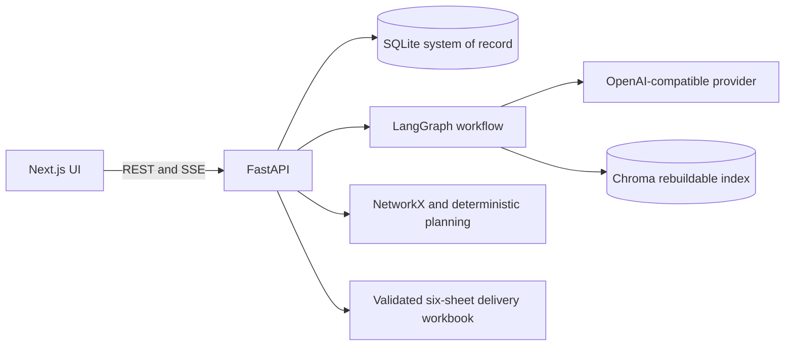
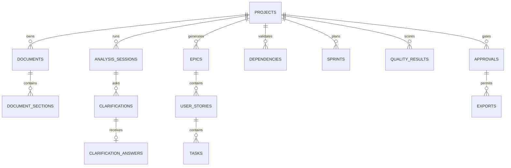

# Sprint Sarthi

Sprint Sarthi is a human-governed AI Scrum Master that turns architecture and requirement documents into a traceable, dependency-aware backlog. It runs directly on Windows with Python, Node.js, SQLite, and a rebuildable Chroma index. No Docker is required.

## Architecture



The browser only receives the backend URL. `LLM_API_KEY` is read by FastAPI and never exposed through a `NEXT_PUBLIC_` variable. Irreversible exports require a persisted approval record.

### LLMAAS Configuration

The backend exchanges `LLMAAS_CLIENT_ID` and `LLMAAS_CLIENT_SECRET` for a short-lived OAuth token. It sends `LLM_API_KEY` separately as the `X-LLM-API-CLIENT-ID` header required by LLMAAS. Tokens are cached until shortly before expiry; credentials, token values, and provider response bodies are excluded from errors and logs.

Set these values directly in the Git-ignored `backend/.env` file:

```dotenv
LLM_API_KEY=<LLMAAS API client key>
LLMAAS_CLIENT_ID=<Cloud IDP OAuth client ID>
LLMAAS_CLIENT_SECRET=<Cloud IDP OAuth client secret>
```

The configured defaults use `https://llmapi.ai.vwgroup.com`, `gpt-4o`, and `text-embedding-3-large`.

## Data Model



Alembic manages all requested tables, constraints, indexes, UUID strings, timestamps, and foreign keys.

## LangGraph State

Each execution uses a stable UUID `thread_id` and SQLite checkpoint persistence. Typed state contains `project_id`, `session_id`, `thread_id`, document IDs, source references, clarification cursor and answers, generated item IDs, validation errors, current node, status, and approval state. Clarification nodes persist before interrupting and resume the exact thread.

Node order: Document Intake, Document Analysis, Clarification, Requirement, Epic, Story, Task, Acceptance Criteria, Traceability, Dependency, Estimation, Resource Assignment, Sprint Planning, Duplicate Detection, Quality, Board Health, Human Approval, Publisher.

Planning data is imported from the user workbook and validated row by row. Missing or contradictory values create blocking clarification issues; the application does not invent planning facts. Assignment and sprint outputs remain recommendations until an identified human explicitly approves them. Reject and request-changes decisions never invoke the Publisher.

## Windows Setup

Prerequisites: Python 3.11+, Node.js 20+, and pnpm. In PowerShell:

```powershell
cd backend
py -3.11 -m venv .venv
.venv\Scripts\Activate.ps1
python -m pip install -e ".[test,ai]"
Copy-Item .env.example .env
python -m alembic upgrade head
python -m uvicorn app.main:app --reload --host 127.0.0.1 --port 8000
```

In a second window:

```powershell
cd frontend
pnpm install
$env:NEXT_PUBLIC_API_URL="http://localhost:8000/api/v1"
pnpm dev
```

Open `http://localhost:3000`; API docs are at `http://localhost:8000/docs`. Root `start-backend.bat` and `start-frontend.bat` scripts provide the same startup flow.

## Migrations And Tests

```powershell
cd backend
.venv\Scripts\Activate.ps1
python -m alembic revision --autogenerate -m "describe change"
python -m alembic upgrade head
python -m pytest -q

cd ..\frontend
pnpm lint
pnpm build
```

## Implementation Checklist

- [x] Next.js and FastAPI repository split
- [x] Async SQLite foundation and complete Alembic schema
- [x] Project creation, secure upload, request IDs, narrow CORS, audit events
- [x] Dependency DAG validation and exact quality weights
- [x] Exact six-sheet styled and validated workbook builder
- [x] Functional project creation and upload UI
- [x] Document extraction and Chroma chunk indexing
- [x] Interruptible clarification LangGraph, strict output retry, and source validation
- [x] Requirement agent with clarification context, stable IDs, traceability, and execution metadata
- [x] Epic, Story, Task, and remaining backlog-generation LangGraph nodes
- [x] Backlog generation, duplicate detection, deterministic allocation
- [x] Review, planning, quality, approval and export API/UI flows
- [x] Synthetic end-to-end workbook test
