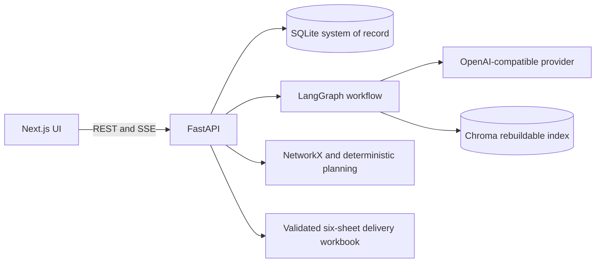
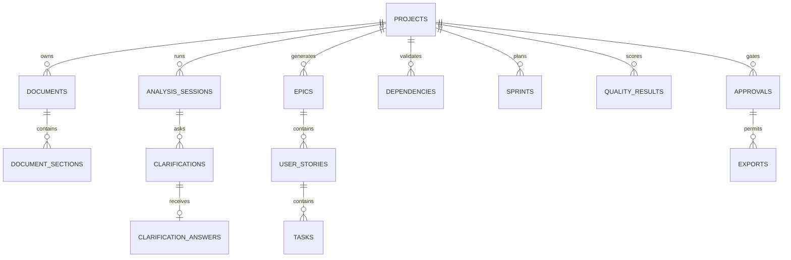

# Sprint Sarthi

Sprint Sarthi is a human-governed AI Scrum Master that turns architecture and requirement documents into a traceable, dependency-aware backlog. It runs directly on Windows with Python, Node.js, SQLite, and a rebuildable Chroma index. No Docker is required.

## Architecture



The browser only receives the backend URL. `LLM_API_KEY` is read by FastAPI and never exposed through a `NEXT_PUBLIC_` variable. Irreversible exports require a persisted approval record.

### LLMAAS Configuration

The backend exchanges `LLMAAS_CLIENT_ID` and `LLMAAS_CLIENT_SECRET` for a short-lived OAuth token. It sends `LLM_API_KEY` separately as the `X-LLM-API-CLIENT-ID` header required by LLMAAS. Tokens are cached until shortly before expiry; credentials, token values, and provider response bodies are excluded from errors and logs.

Set these values directly in the Git-ignored `backend/.env` file:

```dotenv
LLM_API_KEY=<LLMAAS API client key>
LLMAAS_CLIENT_ID=<Cloud IDP OAuth client ID>
LLMAAS_CLIENT_SECRET=<Cloud IDP OAuth client secret>
```

The configured defaults use `https://llmapi.ai.vwgroup.com`, `gpt-4o`, and `text-embedding-3-large`.

## Data Model



Alembic manages all requested tables, constraints, indexes, UUID strings, timestamps, and foreign keys.

## LangGraph State

Each execution uses a stable UUID `thread_id` and SQLite checkpoint persistence. Typed state contains `project_id`, `session_id`, `thread_id`, document IDs, source references, clarification cursor and answers, generated item IDs, validation errors, current node, status, and approval state. Clarification nodes persist before interrupting and resume the exact thread.

Node order: Document Intake, Document Analysis, Clarification, Requirement, Epic, Story, Task, Acceptance Criteria, Traceability, Dependency, Estimation, Resource Assignment, Sprint Planning, Duplicate Detection, Quality, Board Health, Human Approval, Publisher.

Planning data is imported from the user workbook and validated row by row. Missing or contradictory values create blocking clarification issues; the application does not invent planning facts. Assignment and sprint outputs remain recommendations until an identified human explicitly approves them. Reject and request-changes decisions never invoke the Publisher.

## Local Setup

### Prerequisites

- Git
- Python 3.11 or newer
- Node.js 20 or newer
- pnpm 10 (`corepack enable` or `npm install --global pnpm`)
- LLMAAS credentials with access to the configured chat and embedding models

Verify the toolchain:

```powershell
git --version
py -3.11 --version
node --version
pnpm --version
```

### 1. Clone The Repository

```powershell
git clone <repository-url>
cd Sprint-Sarthi
```

### 2. Configure And Start The Backend

Run these commands from the repository root in PowerShell:

```powershell
cd backend
py -3.11 -m venv .venv
.venv\Scripts\Activate.ps1
python -m pip install --upgrade pip
python -m pip install -e ".[test,ai]"
Copy-Item .env.example .env
```

Edit `backend/.env` and replace these placeholders with valid credentials:

```dotenv
LLM_API_KEY=<LLMAAS_API_CLIENT_KEY>
LLMAAS_CLIENT_ID=<CLOUD_IDP_OAUTH_CLIENT_ID>
LLMAAS_CLIENT_SECRET=<CLOUD_IDP_OAUTH_CLIENT_SECRET>
```

Keep credentials only in `backend/.env`. Never add secrets to `.env.example`, frontend variables, or Git.

Create/update the SQLite schema and start FastAPI:

```powershell
python -m alembic upgrade head
python -m uvicorn app.main:app --reload --host 127.0.0.1 --port 8000
```

Confirm the backend is ready:

```powershell
Invoke-RestMethod http://127.0.0.1:8000/health
```

Expected response: `status: ok`. API documentation is available at `http://127.0.0.1:8000/docs`.

### 3. Configure And Start The Frontend

Open a second PowerShell window at the repository root:

```powershell
cd frontend
Copy-Item .env.example .env.local
pnpm install
pnpm dev
```

Open `http://localhost:3000`.

The frontend environment file contains:

```dotenv
NEXT_PUBLIC_API_URL=http://127.0.0.1:8000/api/v1
```

Restart `pnpm dev` after changing this value. If the API uses another port, update both `NEXT_PUBLIC_API_URL` and the backend command. If the frontend uses another origin, also update `FRONTEND_ORIGIN` in `backend/.env` for CORS.

### Windows Startup Scripts

After `backend/.env` has been configured, these scripts can start each service in separate terminals:

```powershell
.\start-backend.bat
.\start-frontend.bat
```

The backend script creates the virtual environment when absent, installs runtime dependencies, applies migrations, and starts port 8000. The frontend script installs packages when absent and starts port 3000.

### macOS Or Linux

Use the same environment values with these command substitutions:

```bash
cd backend
python3.11 -m venv .venv
source .venv/bin/activate
python -m pip install --upgrade pip
python -m pip install -e '.[test,ai]'
cp .env.example .env
python -m alembic upgrade head
python -m uvicorn app.main:app --reload --host 127.0.0.1 --port 8000
```

In another terminal:

```bash
cd frontend
cp .env.example .env.local
pnpm install
pnpm dev
```

## First Run Workflow

1. Open `http://localhost:3000` and create a project.
2. Upload one or more supported architecture documents.
3. Process the documents and answer required clarifications.
4. Run each unlocked agent in order; generated work remains proposed.
5. At Planning Data, download the editable XLSX template, replace its sample entries, and upload it.
6. Review assignments, Sprint scope, duplicate candidates, quality, and board health.
7. Record a named human approval before publishing the six-sheet workbook.

The application never automatically approves, publishes, or silently resequences committed work.

## Tests And Production Build

Backend:

```powershell
cd backend
.venv\Scripts\Activate.ps1
python -m pytest -q
```

Frontend:

```powershell
cd frontend
pnpm lint
pnpm build
pnpm start
```

`pnpm start` serves the production build on `http://localhost:3000` after `pnpm build`.

## Database Migrations

Run migration commands from `backend` with the virtual environment active:

```powershell
python -m alembic upgrade head
python -m alembic revision --autogenerate -m "describe change"
```

SQLite data, uploads, exports, and LangGraph checkpoints are created under `backend/` and are excluded from Git.

## Troubleshooting

- **PowerShell blocks activation:** run `Set-ExecutionPolicy -Scope Process Bypass`, then activate the virtual environment again.
- **Frontend cannot reach the API:** verify `/health`, confirm `frontend/.env.local`, restart Next.js, and check that `FRONTEND_ORIGIN` matches the browser origin.
- **Port already in use:** stop the existing process or choose another port and update the matching environment URL.
- **Planning Data returns 200 but Assignment stays locked:** inspect `requires_clarification` and the blocking sheet/row messages. A validation-only response does not import the workbook.
- **LLMAAS authentication fails:** verify all three credential values in `backend/.env`; do not place them in frontend environment files.
- **Reset local data:** stop the backend and remove the SQLite files under `backend/data/`, then run `python -m alembic upgrade head`. This permanently removes local workflow history.

## Implementation Checklist

- [x] Next.js and FastAPI repository split
- [x] Async SQLite foundation and complete Alembic schema
- [x] Project creation, secure upload, request IDs, narrow CORS, audit events
- [x] Dependency DAG validation and exact quality weights
- [x] Exact six-sheet styled and validated workbook builder
- [x] Functional project creation and upload UI
- [x] Document extraction and Chroma chunk indexing
- [x] Interruptible clarification LangGraph, strict output retry, and source validation
- [x] Requirement agent with clarification context, stable IDs, traceability, and execution metadata
- [x] Epic, Story, Task, and remaining backlog-generation LangGraph nodes
- [x] Backlog generation, duplicate detection, deterministic allocation
- [x] Review, planning, quality, approval and export API/UI flows
- [x] Synthetic end-to-end workbook test
